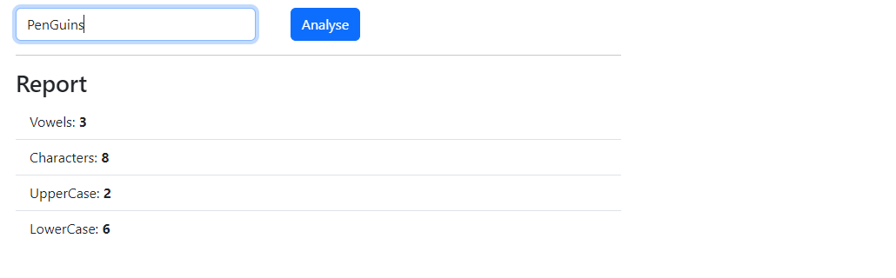
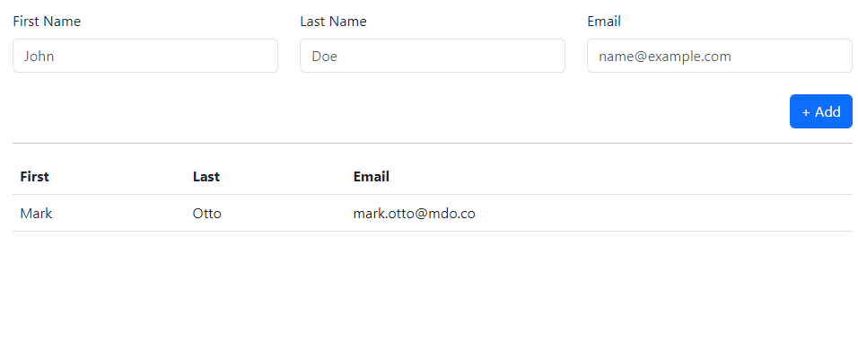
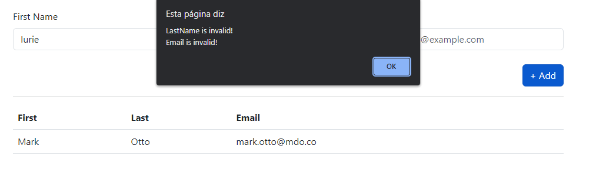
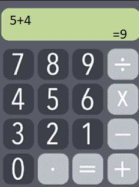

___
## Initial Remarks

- Each exercise should have its own `html` file and\or ``.js`` & ``.css`` files;
- Each html page should have the student's name as the ``title``;
- External libraries are allowed; (eg. [bootstrap](https://getbootstrap.com/docs/5.3/getting-started/introduction/), [tailwind](https://tailwindcss.com/))
- A `.zip` file containing the code should be attached to the MS Teams assignment
 

___
## Suggested Resources

 [toUpperCase](https://developer.mozilla.org/en-US/docs/Web/JavaScript/Reference/Global_Objects/String/toUpperCase)
 | [toLowerCase](https://developer.mozilla.org/en-US/docs/Web/JavaScript/Reference/Global_Objects/String/toLowerCase)
 | [split](https://developer.mozilla.org/en-US/docs/web/javascript/reference/global_objects/string/split)
 | [Trim](https://developer.mozilla.org/en-US/docs/Web/JavaScript/Reference/Global_Objects/String/Trim)
 | [innerHTML](https://www.w3schools.com/jsref/prop_html_innerhtml.asp)
 | [HTMLCollection](https://www.w3schools.com/jsref/dom_obj_htmlcollection.asp)
 | [getElementsByClassName](https://www.w3schools.com/jsref/met_element_getelementsbyclassname.asp)
 | [onclick ](https://www.w3schools.com/jsref/event_onclick.asp)

 

____ 
## Exercises

### 1) Text field & strings
- Create a form with 1 field and button as shown in the image template;
- When clicking the button, the string inserted in the text field is analysed and a report is generated with the information regarding: upper chars, lower chars, vowels, char count (as shown in the image)
- Before analysing the string, the string should be `trimed`
- General template:   

### 2) Form & Table
- Create a form with 3 fields and button as shown in the image template;
- When clicking the button, a new row should be added to the table with the person's information;
- In case any of the fields is empty or has less than 3 characters, show an `alert` with the error and dont add the entry to the table;
- In case the fields are valid, add the person's information and clear the fields aftwerwards;
- The fields should have the ``placeholders`` shown in the image;
- The color scheme and design is up you (and will be evaluated);
- General template:   

- Alert message shown when the form is missing the fields: last name, email:   

### 3) Calculator 
- Create a calculator with the actions and general layout of the image;
- The result should be rounded up to 2 decimal places;
- In case the result cannot be calculated, show the output `=NaN`
- The color scheme and design is up you (and will be evaluated);
- General template:   

